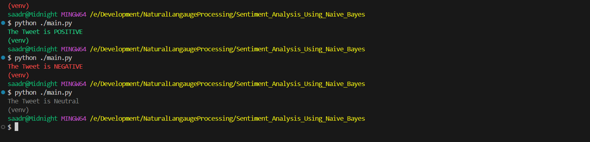

## Overview

# Twitter Sentiment Analysis using Naive Bayes

This project implements a **Naive Bayes–based sentiment classifier** that predicts whether a given tweet is **positive** or **negative**.  
It is trained using the **NLTK Twitter Samples dataset** and applies standard **Natural Language Processing (NLP)** techniques.

---

## 📌 Overview

The classifier learns from labeled tweets and predicts the sentiment of a new input tweet based on the **Naive Bayes assumption**, which treats each word in a tweet as **conditionally independent** given the sentiment label.

---

## 🧠 Naive Bayes Assumption

> Each word in a tweet contributes independently to the overall sentiment.

Using this assumption, the classifier:
- Computes the probability of a tweet being **positive** or **negative**
- Uses **log probabilities** to prevent numerical underflow
- Classifies sentiment based on the higher probability score

---

## 📊 Dataset

- Source: **`nltk.corpus.twitter_samples`**
- Files used:
  - `positive_tweets.json`
  - `negative_tweets.json`

### Data Split
- **Training Set**
  - 4,000 positive tweets
  - 4,000 negative tweets
- **Test Set**
  - Remaining tweets from each class

---

## 📁 Project Structure
.
├── main.py
├── requirements.txt
├── helper.py
└── README.md

---

## ✨ Features

- Tweet preprocessing:
  - URL removal
  - Hashtag and mention handling
  - Tokenization
  - Stopword removal
  - Word stemming
- Frequency-based word counting
- Naive Bayes training with **Laplace smoothing**
- Sentiment prediction for custom input tweets

---
## Results(Screenshots)



## ▶️ Usage


## *You can also install all requirements using requirements.txt*

### Install Required NLTK Data
```python
import nltk
nltk.download('twitter_samples')
nltk.download('stopwords')


## 📈 Model Performance

The Naive Bayes classifier was evaluated on a held-out test set from the NLTK Twitter Samples dataset.

- **Accuracy:** 99.5%

This result shows that the model performs very well on short, sentiment-rich text such as tweets.


